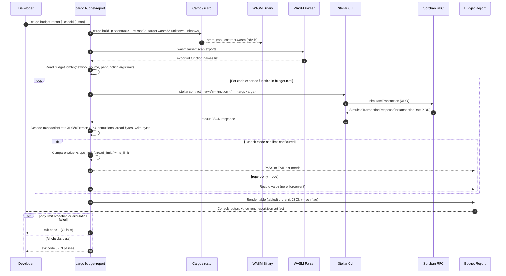

# Architecture Diagrams

Visual reference for the two primary subsystems in `soroban-budget-assert`.
Both diagrams are authored in [Mermaid](https://mermaid.js.org/) and render
natively on GitHub and GitBook.

---

## Diagram 1 — `cargo-budget-report` Pipeline

Shows the end-to-end lifecycle from the developer running `cargo budget-report`
through WASM compilation, export discovery, RPC simulation, metric extraction,
and final report generation. The `--check` path is highlighted to show how CI
enforcement works.



**Source file:** [`cargo-budget-report-pipeline.mmd`](./cargo-budget-report-pipeline.mmd)

---

## Diagram 2 — `#[budget_cpu_lt]` Macro Compile-Time Expansion

Shows how the `budget_cpu_lt` procedural macro rewrites a test function at
compile time. Covers both the static integer form (`#[budget_cpu_lt(N)]`) and
the dynamic environment-variable form (`#[budget_cpu_lt(env = "VAR")]`), and
traces the two runtime outcomes: passing within the limit and panicking on a
regression.

```mermaid
graph TD
    A["#[budget_cpu_lt(N)] or\n#[budget_cpu_lt(env = \"VAR\")]"]
    A --> B[Proc-macro invoked at compile time\nby rustc]

    B --> C{Parse attribute tokens}

    C -->|Integer literal| D["BudgetLimit::Int(N)\nlimit_expr = quote! { N }"]
    C -->|env = \"VAR\" syntax| E["BudgetLimit::EnvVar(VAR)\nlimit_expr = quote! {\n  match budget_env_resolve(VAR) { … }\n}"]

    D --> F[Parse test fn body via syn::ItemFn]
    E --> F

    F --> G[Inject preamble into fn body:\nlet budget_env_resolve = |var| std::env::var(var).ok()]

    G --> H[Append cost-check epilogue:\nlet budget = env.cost_estimate().budget();\nlet cpu_cost = budget.cpu_instruction_cost();\nlet limit_u64: u64 = limit_expr;\nassert!(cpu_cost < limit_u64, …)]

    H --> I[Emit rewritten fn tokens\nback to rustc]

    I --> J{Runtime: test executes}

    J -->|cpu_cost < limit_u64| K["Test passes ✅"]
    J -->|cpu_cost >= limit_u64| L["panic! with message:\n'CPU instruction cost N exceeded limit M\n- local estimate, real network cost\nmay differ significantly in either direction'"]

    L --> M{#[should_panic] present?}
    M -->|Yes — deliberate regression fixture| N["Test passes ✅\n(expected failure documented)"]
    M -->|No — real regression| O["Test fails ❌\nCI exits non-zero"]

    style A fill:#1e3a5f,color:#fff,stroke:#4a90d9
    style K fill:#1a4731,color:#fff,stroke:#2d7a4f
    style N fill:#1a4731,color:#fff,stroke:#2d7a4f
    style O fill:#5c1a1a,color:#fff,stroke:#c0392b
    style L fill:#5c1a1a,color:#fff,stroke:#c0392b
```

**Source file:** [`budget-cpu-lt-macro-expansion.mmd`](./budget-cpu-lt-macro-expansion.mmd)

---

## Files in this directory

| File | Description |
|------|-------------|
| `cargo-budget-report-pipeline.mmd` | Diagram 1 — full `cargo budget-report` lifecycle |
| `budget-cpu-lt-macro-expansion.mmd` | Diagram 2 — `#[budget_cpu_lt]` compile-time expansion |
| `README.md` | This file — rendered entry point for GitHub and GitBook |
